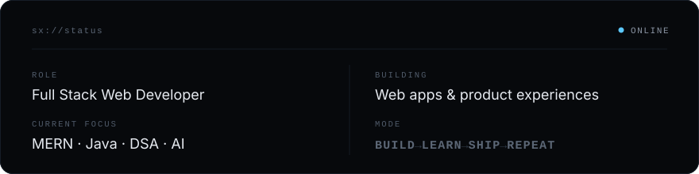
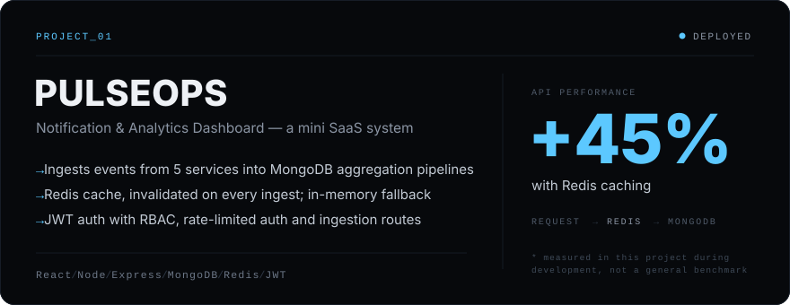
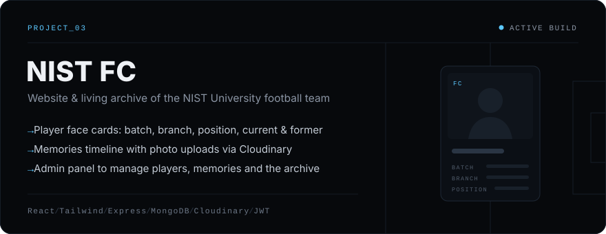
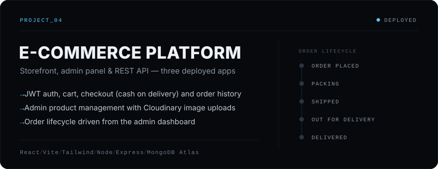

<p align="center">
  
</p>
<p align="right"><sub><a href="#10--signature"><code>/secret/mode</code></a></sub></p>

###### 02 — CURRENT MODE



<br>

###### 03 — TECH CONSTELLATION



<br>

###### 04 — SELECTED WORK

<a href="https://github.com/demoxavi12/notification-analytics-dashboard"></a>

<p>
  <a href="https://mini-saas-system.vercel.app"><code>LIVE ↗</code></a>&nbsp;
  <a href="https://github.com/demoxavi12/notification-analytics-dashboard"><code>SOURCE ↗</code></a>
</p>

<a href="https://github.com/demoxavi12/real-time-chat-application"></a>

<p>
  <a href="https://real-time-chat-application-taupe-six.vercel.app"><code>LIVE ↗</code></a>&nbsp;
  <a href="https://github.com/demoxavi12/real-time-chat-application"><code>SOURCE ↗</code></a>
</p>

<a href="https://github.com/demoxavi12/NIST-FC"></a>

<p>
  <a href="https://github.com/demoxavi12/NIST-FC"><code>SOURCE ↗</code></a>
</p>

<a href="https://github.com/demoxavi12/e-commerce-platform"></a>

<p>
  <a href="https://e-commerce-platform-six-phi.vercel.app"><code>STORE ↗</code></a>&nbsp;
  <a href="https://e-commerce-platform-b11c.vercel.app"><code>ADMIN ↗</code></a>&nbsp;
  <a href="https://github.com/demoxavi12/e-commerce-platform"><code>SOURCE ↗</code></a>
</p>

<br>

###### 05 — ENGINEERING LOG



```text
CURRENTLY EXPLORING

01  DSA / JAVA            daily problems, logged in public
02  BACKEND & SYSTEMS     caching, realtime, auth, testing
03  AI / GENAI            early exploration
04  PRODUCT ENGINEERING   finishing things properly
```

<sub>Practice log → <a href="https://github.com/demoxavi12/DSA-problems">DSA-problems</a></sub>

<br>

###### 06 — TELEMETRY



<br>

###### 07 — CONNECT

<p align="center">
  <b>LET'S BUILD SOMETHING.</b>
</p>
<p align="center">
  <a href="https://swaraj-xavier-portfolio.vercel.app">Portfolio</a> &nbsp;·&nbsp;
  <a href="https://www.linkedin.com/in/swaraj-6009a8332">LinkedIn</a> &nbsp;·&nbsp;
  <a href="https://leetcode.com/u/swaraj_xavier_suna/">LeetCode</a> &nbsp;·&nbsp;
  <a href="https://github.com/demoxavi12">GitHub</a> &nbsp;·&nbsp;
  <a href="https://swaraj-xavier-portfolio.vercel.app/SWARAJ_XAVIER_SUNA_RESUME.pdf">Résumé</a>
</p>
<p align="center">
  <a href="mailto:swarajxaviersuna@gmail.com"><code>swarajxaviersuna@gmail.com</code></a>
</p>

<br>

###### 10 — SIGNATURE

<p align="center">
  
</p>
<p align="center"><sub><code>DETAILS MATTER.</code></sub></p>

<div align="center">
<details>
<summary><sub><code>EASTER_EGG.exe</code></sub></summary>
<br>
<sub>You found it. Lusail, 18.12.2022 — proof that the long game works.<br>
That's why this page skips from 07 to <b>10</b>.</sub>
</details>
</div>

<br>


